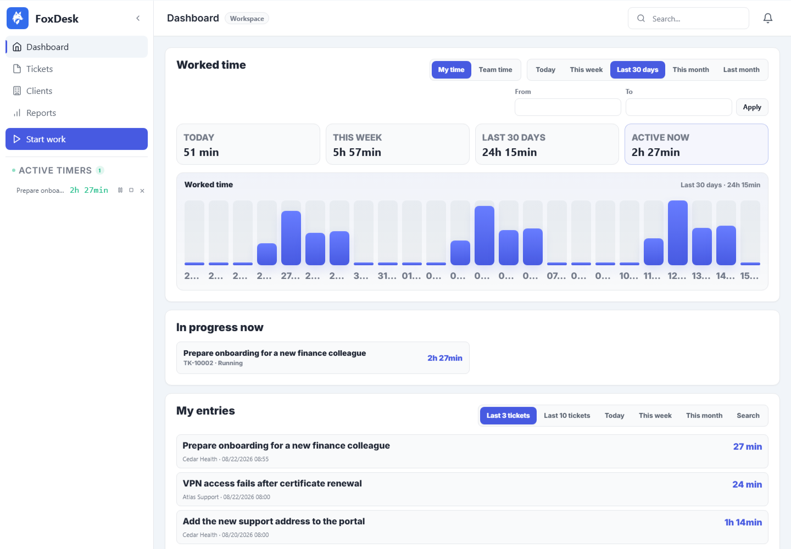
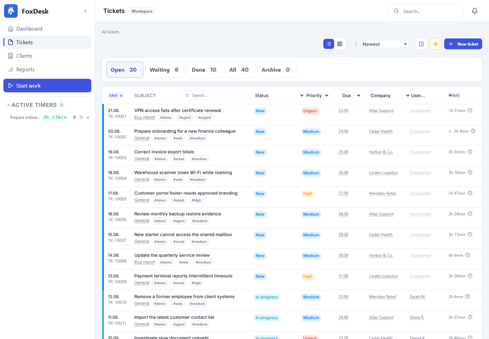
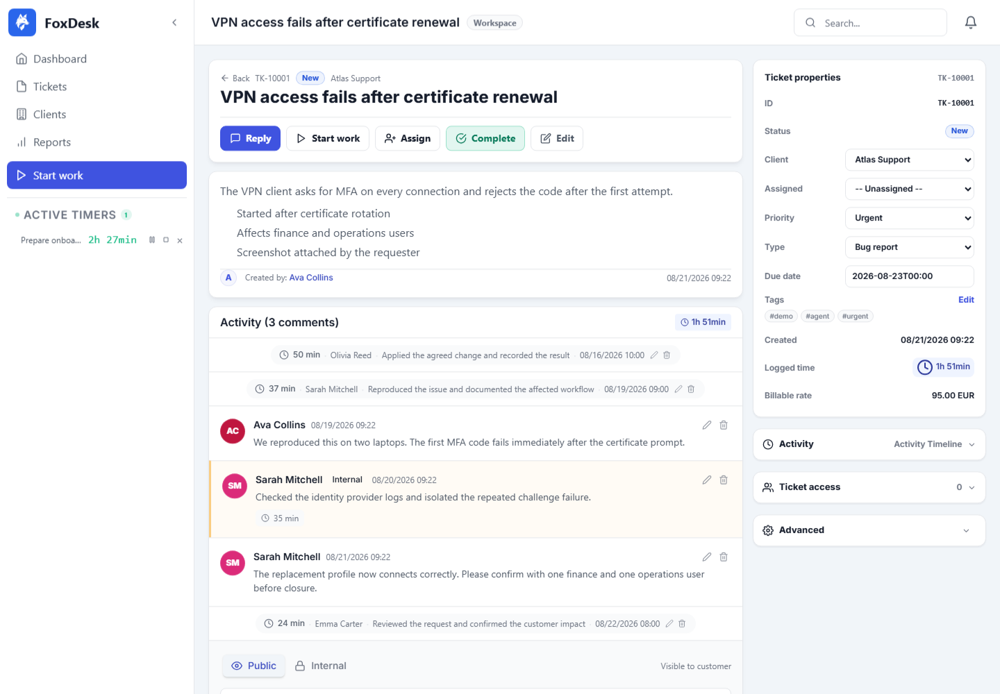
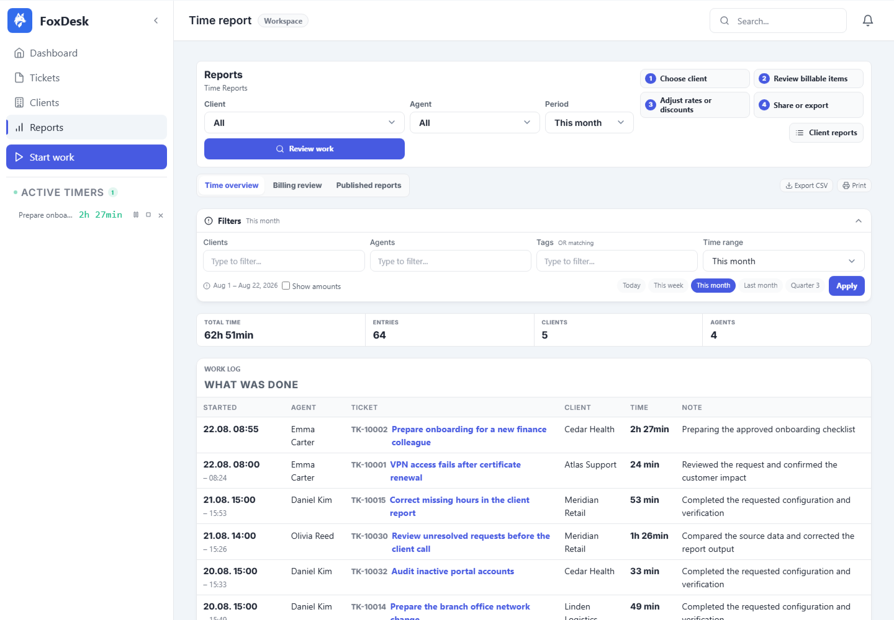
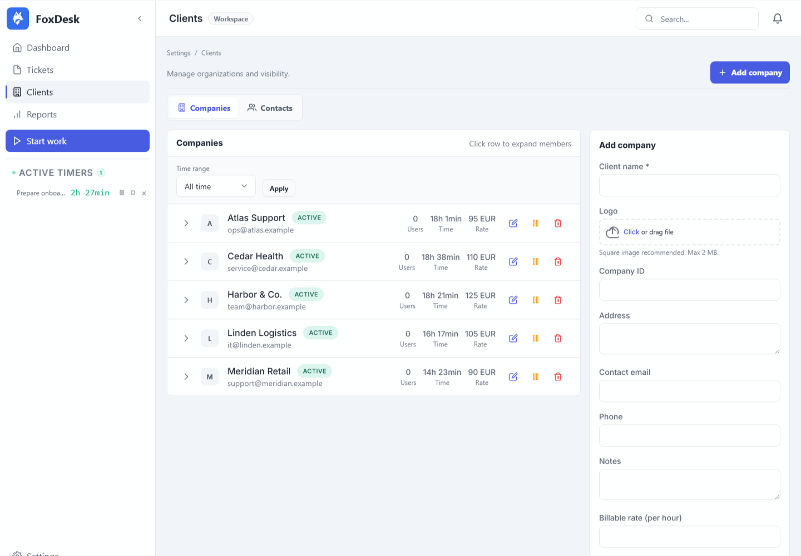
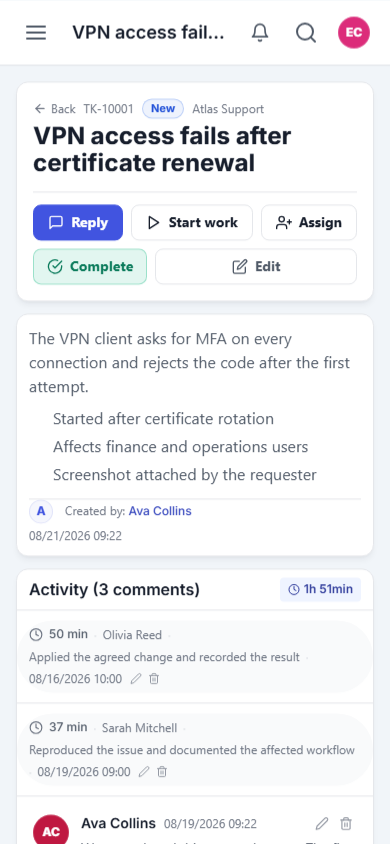

<p align="center">
  
</p>

<h1 align="center">FoxDesk</h1>

<p align="center"><strong>Client requests, recorded work, and clear reports on your own server.</strong></p>

<p align="center">
  Open-source help desk and time tracking for freelancers, agencies, and service teams.
</p>

<p align="center">
  <a href="https://github.com/lukashanes/foxdesk/releases/latest"></a>
  <a href="https://github.com/lukashanes/foxdesk/actions/workflows/tests.yml"></a>
  <a href="LICENSE.md"></a>
  
  
</p>

<p align="center">
  <a href="https://foxdesk.net/getting-started/introduction/">Documentation</a> ·
  <a href="https://github.com/lukashanes/foxdesk/releases/latest">Download</a> ·
  <a href="https://github.com/lukashanes/foxdesk/discussions">Discussions</a> ·
  <a href="https://foxdesk.net/comparison/">FoxDesk Cloud</a>
</p>

[](docs/screenshots/dashboard-light.png)

FoxDesk keeps the request, its owner, the work performed, and the client report in one record. A client can write by email or through the portal. Your team assigns the ticket, records time beside the work, and shares a report without rebuilding the month from inboxes and spreadsheets.

It runs on ordinary PHP hosting or a VPS. There is no per-agent fee, no hosted dependency, and no requirement to send client data to FoxDesk Cloud.

## The workflow

| 1. Receive | 2. Take ownership | 3. Record work | 4. Report |
| --- | --- | --- | --- |
| Turn portal and email requests into tickets with their full context. | Assign an owner, priority, due date, status, and client organization. | Use a timer or an exact manual entry. Keep every note beside the ticket. | Review real time, rates, and completed work before sharing or exporting. |

## Choose how to run FoxDesk

| Self-hosted | FoxDesk Cloud |
| --- | --- |
| The edition in this repository. Install it on your infrastructure and keep operational control. | The managed service for teams that do not want to install, update, back up, or operate FoxDesk. |
| AGPL-3.0, PHP 8.1+, MySQL or MariaDB. | Hosted separately at [foxdesk.net](https://foxdesk.net/comparison/?utm_source=github.com&utm_medium=referral&utm_campaign=foxdesk_open_source). |
| Includes tickets, clients, time tracking, reports, email integration, API access, updates, and all 24 locale catalogs. | Adds managed hosting, tenant lifecycle, subscriptions, backups, and Cloud operations. Those modules are not part of this repository. |

## Install in a few minutes

1. [Download the latest release](https://github.com/lukashanes/foxdesk/releases/latest) and extract it on the server.
2. Create an empty MySQL or MariaDB database.
3. Copy `config.example.php` to `config.php` and enter the database credentials.
4. Open `https://your-domain.example/install.php` and complete the installer.
5. Delete `install.php`, sign in, and create the first client organization.

| Requirement | Minimum |
| --- | --- |
| PHP | 8.1 |
| Database | MySQL 5.7+ or MariaDB 10.2+ |
| PHP extensions | `pdo_mysql`, `mbstring`, `json`, `openssl`, `zip` |
| Initial disk space | 50 MB plus uploaded files and backups |

The detailed guide covers [shared hosting, VPS, Nginx, scheduled tasks, email, upgrades, and recovery](INSTALL.md).

## See the product

### A populated ticket queue

[](docs/screenshots/tickets-light.png)

### Work and time in the same client context

[](docs/screenshots/ticket-detail-light.png)

### Real time before the report is shared

[](docs/screenshots/reports-light.png)

### Client organizations with their own rates and work history

[](docs/screenshots/clients-light.png)

### The same ticket remains usable on mobile

<p align="center">
  <a href="docs/screenshots/ticket-detail-mobile-light.png"></a>
</p>

Dark-mode versions and the reproducible screenshot workflow are in [docs/screenshots](docs/screenshots).

## What is included

### Client requests and ownership

- Email-to-ticket through IMAP or Microsoft 365 OAuth2
- Portal requests, public replies, internal notes, attachments, and secure share links
- Custom statuses, priorities, ticket types, tags, assignees, and due dates
- List and board views, bulk actions, full-text search, and edit history
- Separate company and contact records with client-specific access

### Recorded work and client reports

- Start, pause, resume, and stop timers from the ticket or global sidebar
- Exact manual entries, billable or internal work, and optional rounding
- Cost rates per user, billing rates per client, and ticket-level overrides
- Report review by client, agent, tag, and period
- Shareable client reports plus CSV and print export
- Scheduled weekly, monthly, quarterly, or custom recurring tickets

### Email, access, and operations

- Microsoft 365 and Outlook OAuth2 for inbound and outbound mail
- IMAP intake, SMTP delivery, ticket attachments, CC, and BCC
- Admin, agent, and client roles with organization-scoped access
- TOTP two-factor authentication and backup codes
- Automatic backups before updates, recovery mode, and health checks
- Pseudo-cron fallback for shared hosting plus optional system cron

### Languages and devices

- 24 application locale catalogs from one shared registry
- All 24 locales are selectable in the application; translation maturity varies by locale
- Right-to-left layouts for Arabic, Hebrew, Persian, and Urdu
- CJK-aware input handling for Chinese, Japanese, and Korean
- Responsive interface, dark mode, and installable PWA

## Connect coding agents and automations

FoxDesk exposes scoped bearer-token endpoints for ticket lookup and creation, status changes, comments, and time entries. A connected coding agent can report completed work to the correct client ticket instead of leaving the useful result inside a closed thread.

The repository includes:

- [Agent API quick start](docs/AGENT_API_QUICKSTART.md)
- [MCP server setup for Codex, Claude Code, Cursor, and compatible clients](docs/AGENT_MCP_SERVER.md)
- [Example MCP implementation](examples/agent-api/README.md)
- [Permission and operating guidance](docs/AGENT_API_CONTROL.md)

Tokens inherit the creating user's permissions and can be limited by capability. Do not paste production tokens into prompts, issues, or logs.

## Current release

The latest packaged version is [FoxDesk 0.3.140](https://github.com/lukashanes/foxdesk/releases/tag/v0.3.140), published on August 18, 2026.

It makes client companies the primary Clients view, separates companies from portal contacts, improves narrow-screen administration, and retains the Microsoft 365 mail, reporting, security, and 24-locale work delivered in 0.3.139.

Use the in-app updater or download the release assets from [GitHub Releases](https://github.com/lukashanes/foxdesk/releases). Every release includes upgrade notes, rollback guidance, a manifest, and SHA-256 evidence.

## Development

FoxDesk uses PHP without a backend framework, MySQL or MariaDB, Alpine.js, Tailwind CSS, and a custom token-based UI system.

```text
index.php              Entry point and router
includes/              Authentication, data access, API, email, and shared modules
includes/components/   Reusable interface components
pages/                 Page controllers and views
assets/js/             Browser modules
locales/catalogs/      Translation source catalogs
bin/                   Maintenance, localization, build, and audit tools
tests/                 PHP contracts and Playwright workflows
```

Install JavaScript test dependencies with `npm ci`. The most important repository checks are:

```bash
npm run test:i18n
npm run test:shared-behavior
npm run test:core-parity
npm run test:security-boundary
```

See [CONTRIBUTING.md](CONTRIBUTING.md) before opening a pull request. Questions and installation help belong in [GitHub Discussions](https://github.com/lukashanes/foxdesk/discussions). Reproducible bugs belong in [GitHub Issues](https://github.com/lukashanes/foxdesk/issues).

## Repository scope

This repository is the public release channel for the self-hosted edition. Contributions should improve self-hosted installation, security, local email, ticket and reporting workflows, API integrations, translations, updates, or recovery.

FoxDesk Cloud billing, subscription trials, tenant lifecycle, managed storage, operator administration, and platform deployment are commercial service modules. They are intentionally not published here. The self-hosted reporting rates in this repository are client-work features, not FoxDesk subscription billing.

## Security

Please do not disclose vulnerabilities in public issues. Use [GitHub private vulnerability reporting](https://github.com/lukashanes/foxdesk/security/advisories/new) and follow [SECURITY.md](SECURITY.md).

## License

FoxDesk self-hosted is licensed under the [GNU Affero General Public License v3.0](LICENSE.md).

Created by [Lukas Hanes](https://lukashanes.com) and [AENZE](https://aenze.com/work/foxdesk/).
